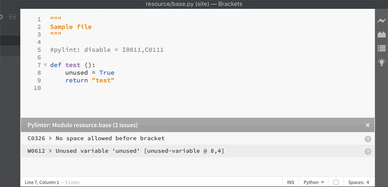

# Pylinter

A Python linter for Brackets. This extension lints Python code on save (with Pylint). It works like JSLint, but for Python.

## Features

- Automatically lints on file open and file save.
- Displays file name and issue counter.
- Configurable lint message [output pattern](#configure).
- Resizable window pane.
- Closable window pane (will stay closed until the file is re-saved).
- Clicking on a lint message will take you to the related line in the code editor.
- Clicking on a lines "?" button will open a more detailed Pylint message.

## Install Pylint

Install Pylint by following instructions from <https://www.pylint.org/#install>

## Install Extension

In the Brackets Extension Manager, either:

- Search for Pylinter
- Use the "install from URL" option and paste in `https://github.com/Grafluxe/pylinter`

Restart Brackets after install.

## Configure

Pylinter comes with two preference options.

- pylinter.outputPattern:
    - The Pylint message output pattern.
    - Defaults to "{msg_id} > {msg} [{symbol} @ {line},{column}]."
    - To further customize the output pattern, use formats specified [here](https://pylint.readthedocs.io/en/latest/user_guide/output.html).
- pylinter.pylintPath:
    - The path to your Pylint install.

## License

Copyright (c) 2016 Leandro Silva (http://grafluxe.com)

Released under the MIT License.

See LICENSE.md for entire terms.
